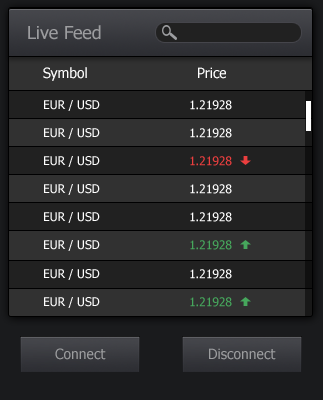

### Socket Assets

**Main Objective:**

Create a "live feed" widget based on the provided design (pandaTest_state1.png, pandaTest2_state2.png) using any JavaScript / TypeScript frontend framework or plain js.

Important Notes:

* Not all information received from the socket is relevant for this task; use only the fields listed below and filter information as specified.
* Only symbols related to the "CRYPTO" category should be used; filter the data received from the socket accordingly (data format explained below).
* Each emit must have a unique reqId object (Already implemented in the provided template).
* You do not have to implement your code in this file; feel free to create your own files.

**Implementation notes for State1 (pandaTest_state1.png):**


* This is the initial application state.
* The socket should be disconnected.
* Switched back to once the socket is disconnected (Disconnect button on state 2).
* The symbol list should be empty.
* The "Connect button" initiates the socket connection.
* Once the socket is connected, the application should switch to state 2.

<br><br>

**Implementation notes for State2 (pandaTest_state1 2.png):**



* The widget should switch to this state once the socket is connected.
* Use the "MT4GetAllSymbols" emit to load all symbols with their initial values.
* Sort the symbol list alphabetically.
* Allow sorting of the symbol list in ascending/descending order when the "Symbol" title is clicked.
* Normalize the display of price decimal points according to the symbol's "digits" value received from "MT4GetAllSymbols," e.g. (symbol price: 1.12349999, digits: 5 -> display: 1.12349).
* Subscribe to "quotesSubscribe" to receive "quotes" and dynamically update the price list.
* As per the provided design, the current quote price should be colored green if it is higher than the previously received one and red if it is lower.
* Add an arrow indicator next to the colored price, with the same color, pointing up if the price is higher or down if lower compared to the previous quote.
* Implement on-the-fly asset name search functionality.

<br><br>

### In order to serve provided template
* Tested on node.js v18.17.0
* Run
```
 npm i
 npm run dev
```
* Open the url provided by vite CLI in browser

